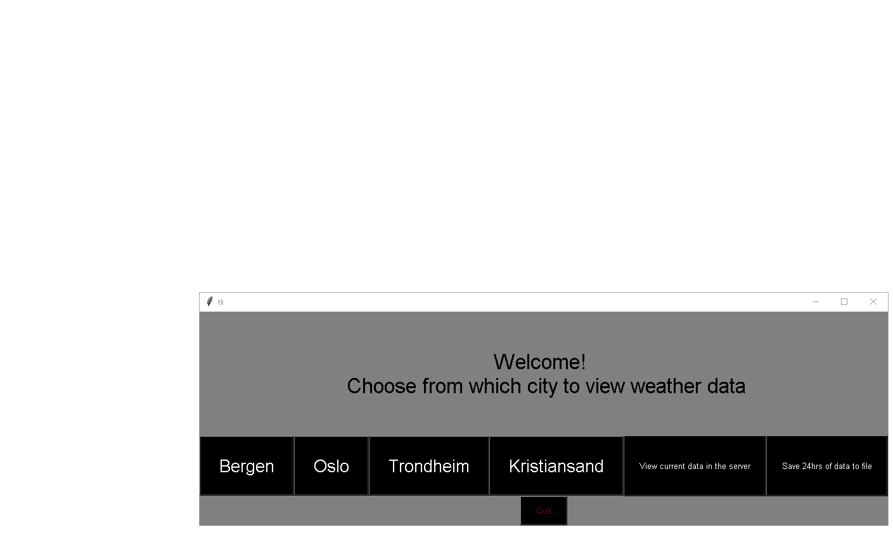
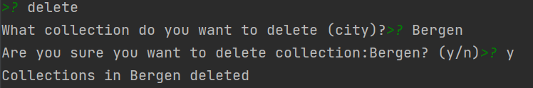
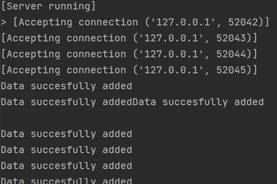
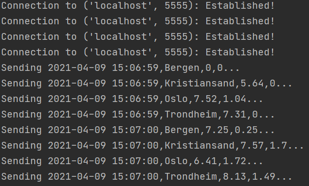
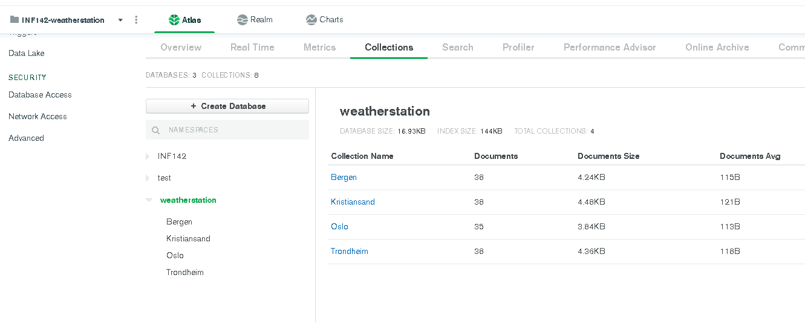

# Weather application in Python

# Description
This weather application takes input from a simulation and stores the data into a MongoDB.

### Scripts

* station.py
* weather_station.py
* storage_server.py
* databaseClient.py
* FMI.py
* web_server.py

## How it works
`station.py` is the simulation which `weather_station.py` takes input from, and sends it to `storage_server.py` via *TCP*.
Then any FMI can connect to `storage_server.py` via *UDP* and use the data for whatever it needs.

### Weather_station (client)

When `weather_station.py` is executed, it will create x amount of weather stations, instantiate them, 
and handle them in separate threads. \
The client will then immediately try to connect to the host and port given in `.env`. If connection is established,
client sends data to the server every hour until either server or client is shut down.

If no initial connection can be established or the server is shut down prematurely, the client will try to reconnect 
every 5 seconds. Any data not yet sent to the server will be lost in transmission due to the fact 
that the client does not store any data.

### Storage_server (server)
When `storage_server.py` is executed, the server starts listening for incoming TCP and UDP connections. Whenever an incoming connection is 
established, the server starts to receive and send data.

`storage_server.py` then does three things: 
1. Adding data to the MongoDB.
2. Saves data to local file.
3. Serves the data on a UDP port for any external apps to use.

Any apps connecting can use a `GET` request to get needed data.
`GET` without arguments returns ALL data, but something like `GET Bergen` returns only data stored for Bergen. 

There is also an interactive mode that enables a console.
It can be accessed by using either the `-i` or the `--interactive` flags.

 **User options in console**
* turn off (*By typing "turn off" or "shut down" in console, the server shuts down.*)
* delete (*An admin can delete collections from MongoDB by typing "delete" in console*)

### FMI (user client)

`FMI.py` is a very simple graphical user interface which connects to `storage_server.py` and receives data via *UDP*. It also
connects to the database in order to show current data in the different collections.

The user also have a possibility to save to a .csv-file

### web_server (user client)
`web_server.py` is a very simple web server which displays a table of everything in the database. It uses the same connection
as any other FMI and displays the data in a very simple html table.

### FLASK (app.py)
`app.py` does almost the same as web_server

### .env
We use a number of environment variables:
* `password` for mongodb password.
* `HOST` and `PORT` for the host and port that `storage_server.py` uses.
* `HTTPHOST` and `HTTPPORT` for the http web server host and port.

## **Visuals**
### Graphical User Interface

### Deletion of collection in `storage_server.py`

#
### Server startup (`storage_server.py`)

#
### Weather station startup (`weather_station.py`)

#
### MongoDB collections

